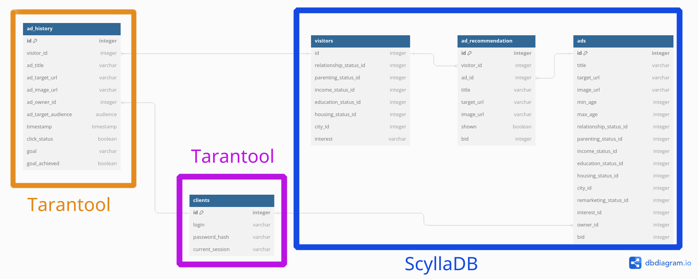
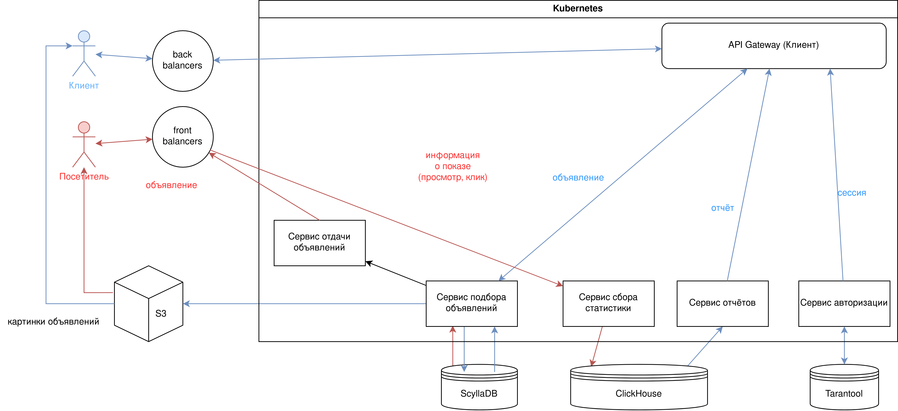

# Яндекс.Директ

## Содержание

* ### [1. Тема, целевая аудитория](#1)
* ### [2. Расчет нагрузки](#2)
* ### [3. Глобальная балансировка](#3)
* ### [4. Локальная балансировка](#4)
* ### [5. Логическая схема баз данных](#5)
* ### [6. Физическая схема баз данных](#6)
* ### [7. Алгоритмы](#7)
* ### [8. Технологии](#8)
* ### [9. Обеспечение надёжности](#9)
* ### [10. Схема проекта](#10)
* ### [11. Рассчёт ресурсов](#11)

## 1 Тема и целевая аудитория

### 1.1 Тема
[Яндекс.Директ](https://direct.yandex.ru/) - система контекстной рекламы Яндекса

### 1.2 MVP

- Создание рекламных объявлений
- Показ рекламных объявлений
- Просмотр аналитики рекламной кампании
- Использование пульта управления рекламой: жалобы на рекламу

### 1.3 Целевая аудитория

Среднемесячная аудитория рекламной сети Яндекса - 91.5 млн. человек [^1]

## 2 Расчет нагрузки

### 2.1 Расчеты

Дневная аудитория - 63.9 млн. человек

В виду недоступности статистики Яндекса
Для расчета количества показываемых в день объявлений воспользуемся статистикой схожего сервиса - Google Ads [^2]

Средняя цена за клик - $1.5
Годовая выручка сервиса = $200 млрд.
Получим количество кликов = 200 млрд. / 1.5 = 133 млрд. кликов
При ctr = 0.46% [^4], рассчитаем количество показов: 133 млрд. / 0.0046 = 28.91 триллионов показов / год, что равняется приблизительно 79 млрд. показов в день

Месячная аудитория Google Ads - 2.5 млрд. человек[^3], что в 27 раз больше месячной аудитории Яндекса.
Примем количество показов в день пропорциональным месячной аудитории. Получим приблизительное значение показов в день равное 2.9 млрд.

Средний RPS показов: 34000
Средний RPS кликов: 156

Примем средний размер рекламного объявления равным 0.5МБ.
Тогда сетевой трафик составит 132 Гбит/c
Трафик в сутки = 1400 ТБ

В 2015 году Яндекс опубликовал количесво рекламодателей [^5]: 394 000 человек. Попробуем найти приблизительное число рекламодателей в 2023 году, исходия из рекламной выручки. Рекламная выручка Яндекса в 2015 году составила 60 млрд. рублей[^5], в 2023 году - 182.5 млрд. рублей[^6].
Число рекламодателей в 2023 году найдём следующим образом: 394 000 * 182.5 / 60 = 1 198 416 рекламодателей.

Допустим, каждый рекламодатель в среднем запрашивает статистику своих рекламных раз в 20 минут.
Получим средний RPS = 1000

Из статистики модерации Яндекс рекламы[^7]:
Пульт управления рекламой используют 103 млн. раза в месяц => 40 RPS

Модерацию проходит 43 млн. объявлений в месяц => 16 RPS
При принятом среднем размере рекламног объявления в 0.5МБ суммарный объём составляет 20.5 ТБ в месяц
Общее число объявлений - 4.5 млрд, общий объём - 2145 ТБ

### 2.2 Продуктовые требования

| Метрика                             | Значение   |
| ----------------------------------- | ---------- |
| Месячная аудитория (MAU)            | 91.5 млн.  |
| Дневная аудитория (DAU)             | 63.9 млн.  |
| Кол-во рекламодателей               | 1.2 млн.   |
| Общее число объявлений              | 4.5 млрд.  |
| Подборов объявлений в день          | 450 млн.   |
| Новых объявлений в месяц            | 103 млн.   |
| Занимаемый всеми объявлениями объем | 2145 ТБ.   |

### 2.3 Технические требования

Примем пиковый RPS равным увеличенному в два раза среднему

| Запрос                              | RPS (средний)   | RPS (пиковый) |
| ----------------------------------- | --------------- | ------------  |
| Создание объявлений                 | 16              | 32            |
| Просмотр статистики                 | 1000            | 2000          |
| Подбор объявлений                   | 34000           | 68000         |
| Обработка кликов                    | 156             | 312           |

Примем пиковый трафик равным увеличенному в два раза среднему

| Запрос                              | Потребляемый трафик (средний) | Потребляемый трафик (пиковый) |
| ----------------------------------- | ----------------------------- | ----------------------------- |
| Создание объявлений                 | 8 Мбит/c                      | 16 Мбит/c                     |
| Подбор объявлений                   | 132 Гбит/с                    | 264 Гбит/c                     |

### 3 Глобальная балансировка

Так как сервис расчитан на Российскую аудиторию, расположим единственный ЦОД в самой густонаселённой части страны - в Москве [^8]. 
Тогда согласно сервису "Looking.house"[^9] задержка сети от ЦОДа до разных городов России будет выглядеть следующим образом:

| Город          | Задержка |
| -------------- | -------- |
| Москва         | 2 мс     |
| Казань         | 25 мс    |
| Краснодар      | 38 мс    |
| Новосибирск    | 43 мс    |
| Красноярск     | 53 мс    |
| Хабаровск      | 102 мс   |
| Владивосток    | 113 мс   |

Как видно из таблицы, самая большая задержка - из Владивостока (113 мс)
Данные сервиса "Не Looking Glass" [^10] выдают похожие результаты

Так как задержка сети не является критичным параметром для сервиса рекламы, данную задержку можно считать приемлемой

### 4 Локальная балансировка

Для обеспечения отказоустойчивости весь входящий в датацентр трафик будет приходить в датацентр через 2 маршрутизатора.
Далее происходит балансировка нагрузки с использованием протокола BGP.
В результате трафик попадает на балансировщики. На каждый балансировщик трафик может прийти с двух свитчей, что способствует обеспечению надёжности системы.

На каждом балансировщике стоит L7 балансировщик нагрузки - NGINX.
Балансировка происходит на основе протокола BGP, что позволяет производить её на основе загруженности каналов.

### 5 Логическая схема баз данных

## Размер таблиц

### Visitors

| Поле | Тип | Размер |
| ---- | --- | ------ |
| id   | int64 | 8 Байт |
| age  | int8 | 1 Байт |
| relationship_status_id | int8 | 1 Байт |
| parenting_status_id | int8 | 1 Байт | 
| income_status_id | int8 | 1 Байта |
| education_status_id | int8 | 1 Байт |
| housing_status_id | int8 | 1 Байт |
| city_id | int32 | 4 Байта |

Итого: 18 Байт

При размере аудитории в 91.5 млн. пользователей получим общий объём таблицы: 1.5 Гб

### Target audiences

| Поле | Тип | Размер |
| ---- | --- | ------ |
| id   | int64 | 8 Байт |
| min_age  | int8 | 1 Байта |
| max_age  | int8 | 1 Байта |
| relationship_status_id | int8 | 1 Байта |
| parenting_status_id | int8 | 1 Байта | 
| income_status_id | int8 | 1 Байта |
| education_status_id | int8 | 1 Байта |
| housing_status_id | int8 | 1 Байта |
| city_id | int 32 | 4 Байта |
| remarketing_status_id | int8 | 1 Байта |

Итого: 20 Байт

Допустим минимальный и максимальный возраст можно будет выбрать в дискретных значениях с разницей в 5 лет от 15 до 85 лет. 
Это даст нам (85 - 15) / 5 + 1 = 15 значений. 
Всего возможно 15 * (15 - 1) = 210 комбинаций этих значений.
Таблицы relationship_status, parenting_status, income_status, housing_status и remarketing_status хранят в среднем около 5 строк каждая. Всего этих таблиц 5.
Возможных комбинаций по этим таблицам: 5^5 = 3125

Согласно https://ru.wikipedia.org/wiki/%D0%93%D0%BE%D1%80%D0%BE%D0%B4%D0%B0_%D0%A0%D0%BE%D1%81%D1%81%D0%B8%D0%B8 в РФ насчитывается 1119 городов.

Общее количество возможных групп посетителей: 210 * 3125 * 1119 = 734343750. Округлим до 750 млн.

Общий объём таблицы составит: 14 Гб

### Ads

| Поле       | Тип | Размер |
| ---------- | --- | ------ |
| id         | int64 | 8 Байт |
| title      | varchar[120] | 120 Байт |
| target_url | varchar[120] | 120 Байт |
| image_url  | varchar[120] | 120 Байт |
| owner_id   | int64 | 8 Байт
| goal_id    | int8  | 1 Байт
| bid        | int32 | 4 Байта

Итого: 381 Байт

Общее число объявлений: 4.5 млрд.
Итого объём таблицы: 1.5 Тб

### Interests

| Поле | Тип | Размер |
| ---- | --- | ------ |
| id   | int64 | 8 Байт |
| name | varchar[40] | 40 Байт |

Итого: 48 Байт

Допустим в нашей системе существует 1000 интересов. Тогда общий размер таблицы будет равен 46.75 Кб

### Ad history

| Поле | Тип | Размер |
| ---- | --- | ------ |
| id   | int64 | 8 Байт |
| visitor_id | int64 | 8 Байт |
| target_audience_id | int64 | 8 Байт |
| ad_id | int64 | 8 Байт |
| ad_host_id | int64 | 8 Байт |
| timestamp | timestamp | 8 Байт |
| click_status | boolean | 1 Байт |
| goal_achievement_status | boolean | 1 Байт |

Итого: 50 Байт

По рассчётам в день происходит 450 млн. подборов, все из них должны попасть в базу данных. Будем хранить данные за 1 предыдущий год. Итого 164 млрд. строк или 7.5 Тб

### Clients

| Поле | Тип | Размер |
| ---- | --- | ------ |
| id   | int64 | 8 Байт |
| login | varchar[40] | 40 Байт | 
| password_hash char[256] | 256 Байт |
| current_session_id | char[4096] | 4096 Байт |

Итого: 4400 Байт

Общее число рекламодателей равно 1.2 млн. Итого размер таблицы: 8.6 Гб 

### Ad hosts

| Поле | Тип | Размер |
| ---- | --- | ------ |
| id   | int64 | 8 Байт |
| client_id | int64 | 8 Байт |
| url | varchar[40] | 40 Байт |

Итого: 56 Байт

При приблизительном количестве сайтов в 40 000. Получим общий размер таблицы равным 2 Мб

### Visitor interests

| Поле | Тип | Размер |
| ---- | --- | ------ |
| visitor_id   | int64 | 8 Байт |
| interest_id  | int64 | 8 Байт |

Итого: 16 Байт

Предположим, что на каждого пользователя приходится около 50 строк. Тогда при количестве посетителей в 91.5 млн. 
Общий объём таблицы Visitor intersts составит 91.5e6 * 50 * 16 Байт = 68 Гб

### Ad target audiences

| Поле | Тип | Размер |
| ---- | --- | ------ |
| id   | int64 | 8 Байт |
| ad_id | int64 | 8 Байт |
| target_audience_id | int64 | 8 Байт |

Итого: 24 Байта

Кажется, что поле id не нужно, но оно понадобится для target_audience_interests

Допустим, для каждого обявления в среднем выделяют по 4 целевых аудитории.
Тогда общее количество строк таблицы: 4.5 млрд. * 4 = 18 млрд.

Общий объём таблицы составит: 402 Гб

### Target audience interests

| Поле | Тип | Размер |
| ---- | --- | ------ |
| ad_target_audience_id   | int64 | 8 Байт |
| interest_id             | int64 | 8 Байт |

Всего: 16 Байт

Допустим каждое объявление связано с 4 интересами.
Тогда общее количество строк таблицы: 4.5 млрд. * 4 = 18 млрд.

Общий объём таблицы: 268 Гб

### Статические таблицы

Таблицы
- relationship statuses
- income statuses
- housing statuses
- education statuses
- remarketing statuses
- ad goals
- cities

| Поле | Тип | Размер |
| ---- | --- | ------ |
| id   | int8 | 1 Байт |
| status| varchar[20] | 20 Байт |

Всего: 21 Байт

Таблица cities содержит 1119 позиций. 
Итого: 22 Кб

Остальные в среднем содержат по 5 строк. 
Итого: 105 Б на таблицу

Всего: 24129 Байт или 23 Кб

### Рассчёт нагрузки

Допустим, что при создании объявления в 50% случаев создаётся запись в Target Audience, и что при подборе объявлений в 10% кликов мы узнаём о новом интересе посетителя. При RTS обработки кликов = 312 получим 31.2 записи в таблицу Visitor Interests в секунду.

| Запрос                              | Чтение из | Запись в | RPS (пиковый) |
| ----------------------------------- | --------- | -------- | ------------  |
| Создание объявлений                 | Clients, Interests, TargetAudiences, Target Audience Interest | Ads, Target Audiences (50% случаев), Ad target audiences, Target Audience Interests | 32  |
| Просмотр статистики                 | Ad history, Ads, Clients, Interests, Ad hosts, Ad target audiences, Target Audiences | - | 2000 |
| Подбор объявлений                   | Все таблицы, кроме Ad history | Ad history, Visitor interests (3.3 RPS) | 68000         |

### Сводка:

| Таблица             | Размер одной строки | Кол-во строк | Общий размер | Нагрузка на чтение(RPS) | Нагрузка на запись(RPS) |
| ------------------- | ------------------- | ------------ | ------------ | ------------------ | ------------------ |
| Visitors            | 18 Байт             | 91.5 млн.    | 1.5 Гб       | 68000 | 31.2 |
| Target Audiences    | 20 Байт             | 750 млн.     | 14 Гб        | 70448 | 16 |
| Ads                 | 381 Байт            | 4.5 млрд.    | 1.5 Тб       | 70418 | 32 |
| Interests           | 48 Байт             | 1000         | 46.75 Кб     | 70448 | X |
| Ad history          | 50 Байт             | 164 млрд.    | 7.5 Тб       | 2032  | 68000 | 
| Clients             | 4400 Байт           | 1.2 млн      | 8.6 Гб       | 70448 | - |
| Ad hosts            | 56 Байт             | 40 000       | 2 Мб         | 70418 | - |
| Visitor interests   | 16 Байт             | 4.55 млрд.   | 68 Гб        | 68000 | 31.2 |
| Ad target audiences | 24 Байта            | 18 млрд.     | 402 Гб       | 70416 | 32 |
| Target audience interests  | 16 Байт      | 18 млрд.     | 268 Гб       | 70448 | 16 |
| Статические таблицы | 21 Байт             | 1149         | 23 Кб        | 70448 | X | 

## 6 Физическая схема баз данных

### Денормализация схемы

Для избежания join'ов по огромным таблицам будем записывать интересы пользователей прямо в visitors, все данные по целевой аудитории напрямую в ads, а данные рекламных объявлений напрямую в ad_history.

### Таблицы в ScyllaDB:

| Таблица           | Ключ шардирования | Размер строки | Кол-во строк | Объём |
| ----------------- | ----------------- | -------- | -------- | - |
| ads               | interest_id       | 409 Байт | 18 млрд. | 6.7 Тб |
| visitors          | id                | 58 Байт  | 4.5 млрд. | 243 Гб |

### Сводка

| СУБД       | Функционал | Таблицы | Производительность | Надежность | Объём | Нагрузка на чтение(RPS) | Нагрузка на запись(RPS) |
| ---------- | ---------- | ------- | ------------------ | ---------- | ----- | ------------------ | ------------------ |
| ScyllaDB   | Хранение рекламных объявлений, данных о посетителях | ads, visitors, visitor_interests | Горизонтальное масштабирование за счёт создания новых нод (node), шардирование  | Реплицирование данных в рамках одного кластера. По умолчанию replication factor = 3 | 8.4 Тб | 70448 | 32 |
| ClickHouse | Хранение истории просмотров для создания отчётов, обновления интересов пользователей | Ad history | Шардирование данных | Горячее резервирование | 7.5 Тб | 2032 | 68000 |
| Tarantool  | Хранение данные о сессиях | Clients | Полностью помещается в оперативную память | Реплики | 8.5 Гб | 2032 | 1

Все изображения будут храниться в файловых хранилищах. Размер файлов: 2145 ТБ.

## 7 Алгоритмы 

### Подбор рекламных объявлений

1. идентифицируем интересы посетителя
2. выбираем все объявления по данным интересам (самая высокая селективность из всех критериев)
3. отсеиваем по остальным критериям
4. проводим аукцион - побеждает объявление с самым высоким значением bid

## 8 Технологии

| Технология | Область применения | Мотивационная часть |
| ---------- | ------------------ | ------------------- |
| Go         | ЯП Backend'а       | Надёжность, скорость, простая асинхронная модель |
| TypeScript, React | Frontend     | Гибкость, высокая скорость разработки
| nginx      | reverse proxy, балансировщик | Скорость, гибкость |
| ScyllaDB   | БД для объявлений и данных посетителей |Масштабируемость, высокая скорость | 
| ClickHouse | БД для хранения истории, формирование статистических отчётов | Масштабируемость, высокая скорость |
| Tarantool  | Key-value БД для хранения данных клиентов | Высокая скорость |
| Kubernetes | Оркестрация | Масштабируемость, эффективное использование ресурсов |
| Prometheus | Сбор метрик, их хранение | Стандарт индустрии |
| Grafana    | Визуализация собранных метрик | Лидер индустрии |
| Ceph       | Объектное хранилище           | Масштабируемость, совместимость с S3 API |

## 9 Обеспечение надёжности 

<table>
    <tr>
      <th>Раздел / Технология</th>
      <th>Что обеспечивает надёжность</th>
    </tr>
    <tr>
      <td>ScyllaDB</td>
      <td>
        <ul>
            <li>Репликация данных</li>
            <li>Отсутствие центрального узла</li>
        </ul>
      </td>
    </tr>
    <tr>
      <td>ClickHouse</td>
      <td>
        <ul>
            <li>Репликация данных</li>
            <li>Горячее резервирование</li>
        </ul>
      </td>
    </tr>
    <tr>
      <td>Tarantool</td>
      <td>Репликация данных</td>
    </tr>
    <tr>
      <td>Объектное хранилище</td>
      <td>резервные копии данных</td>
    </tr>
    <tr>
      <td>Локальная балансировка</td>
      <td>
        <ul>
            <li>2 роутера на входе</li>
            <li>слой access switch'ей</li>
            <li>слой L7 балансировщиков</li>
        </ul>
      </td>
    </tr>
    <tr>
      <td>Kubernetes</td>
      <td>
        <ul>
            <li>Масштабирование сервисов исходя из нагрузки</li>
            <li>эфемерность подов</li>
            <li>регулярные health check'и</li>
        </ul>
      </td>
    </tr>
</table>

## 10 Схема проекта 

## 11 Рассчёт ресурсов 

## Источники
[^1]: [Статистика по аудитории Яндекса](https://radar.yandex.ru/)
[^2]: [Общая статистика Google Ads](https://www.digitalthirdcoast.com/blog/google-ads-statistics)
[^3]: [Статистика по аудитории Google Ads](https://prodima.vn/en/what-is-the-reach-of-the-google-display-network/)
[^4]: [Статистика по ctr Google Ads](https://www.wordstream.com/blog/ws/2016/02/29/google-adwords-industry-benchmarks)
[^5]: [Финансовый отчёт Яндекса 2015](https://yastatic.net/s3/ir-docs/financials/2015/4Q2015_RUS.pdf)
[^6]: [Финансовый отчёт Янедкса 2023](https://yastatic.net/s3/ir-docs/financials/2023/2Q2023_RUS.pdf)
[^7]: [Отчёт Яндекса по модерации рекламы](https://ya.ru/project/admoderation/2023#screen01)
[^8]: [Плотность населения РФ](https://ru.wikipedia.org/wiki/%D0%9F%D0%BB%D0%BE%D1%82%D0%BD%D0%BE%D1%81%D1%82%D1%8C_%D0%BD%D0%B0%D1%81%D0%B5%D0%BB%D0%B5%D0%BD%D0%B8%D1%8F_%D1%81%D1%83%D0%B1%D1%8A%D0%B5%D0%BA%D1%82%D0%BE%D0%B2_%D0%A0%D0%BE%D1%81%D1%81%D0%B8%D0%B9%D1%81%D0%BA%D0%BE%D0%B9_%D0%A4%D0%B5%D0%B4%D0%B5%D1%80%D0%B0%D1%86%D0%B8%D0%B8)
[^9]: [Looking.house](https://looking.house/point.php?id=651)
[^10]: [Не Looking Glass RuVDS](https://lg.ruvds.com/)
